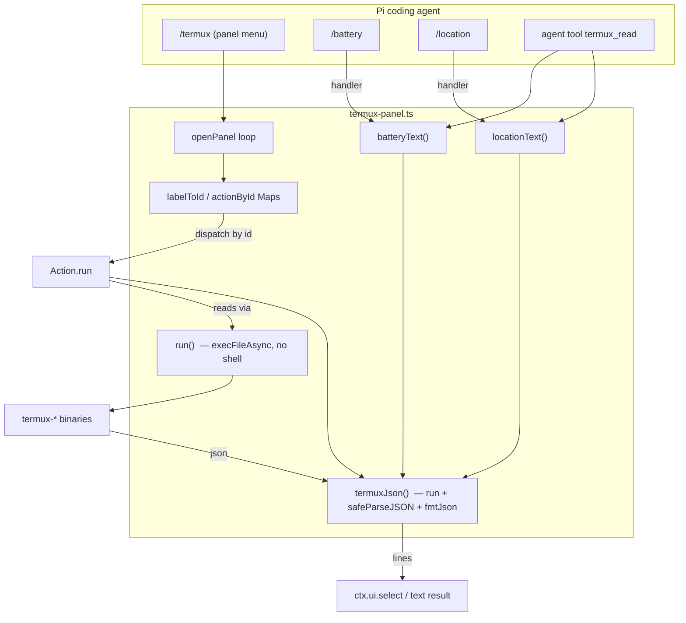

# termux-panel-live

Single-file [Pi](https://github.com/earendil-works/pi) extension: a keyboard-driven device dashboard for Termux devices. Exposes three Pi commands and one agent-readable tool for reading Termux:API device status off the UI thread.

- **What it is:** one file (`termux-panel.ts`) dropped into `~/.pi/agent/extensions/`, then `/reload` in Pi.
- **Why:** control a Termux device from the Pi TUI or let the Pi agent interrogate device state without opening a menu.
- **Requires:** Termux:API app (F-Droid) + `pkg install termux-api`. Location needs sky view + permission; GPS can time out.

## Install

```bash
mkdir -p ~/.pi/agent/extensions/
cp termux-panel.ts ~/.pi/agent/extensions/termux-panel.ts
# in Pi TUI:
/reload
```

## Commands (slash)

| Command | Runs |
| --- | --- |
| `/termux` | Open the panel menu |
| `/battery` | Show battery status |
| `/location [provider]` | Show location (provider: `network` default · `gps` · `passive`; e.g. `/location gps`) |

`/termux` is interactive only (`ctx.mode === tui` or `ctx.hasUI`); other commands return a warning when no UI is available.

## Agent tool

`termux_read` — headless-safe, **read-only**, no side effects. The agent can call this mid-task even when you are not present.

```
termux_read <field> [provider]
  field:   battery | location
  provider (location only): network | gps | passive   (default: network)
```

Returns plain text lines (same formatting as the menu view). Failures return an `apiError` hint (install hint, timeout hint, permission hint). **No write actions are exposed to the agent** — SMS/notify/torch/photo/camera/vibrate stay command-and-confirm only, so the agent cannot spam or exfiltrate without a prompt.

## Panel actions

📊 Device Overview · 🔋 Battery · 📍 Location · 📋 Clipboard get/set · 🔦 Torch · 📷 Photo · 💬 Send SMS · 🔔 Notification · 📳 Vibrate · 🗣️ TTS · ℹ️ System Info · 📶 WiFi.

SMS send requires `ctx.ui.confirm` (the control for malformed numbers — digit validation is intentionally dropped for international formats). Photo saves to `/storage/emulated/0/Pictures/termux_<Date.now()>.jpg` using camera `-c 0`.

## Security

- All CLI calls go through a single `run()` helper using `execFileAsync` — **no shell**, so injection is structurally impossible (args are a string array).
- `termux-api` errors are mapped by `apiError()`: ENOENT → install hint, timeout → GPS hint, permission → settings hint, else raw message; all routed through `withErrors` so a single failing action never crashes the loop.
- Agent tool is `registerTool`, reads-only, no `ctx.ui`: it cannot send SMS, take photos, toggle torch, or push notifications.

## Architecture

Single-file, flat functional module. One factory exports a function `(pi: ExtensionAPI)`.



## Build / verify

```bash
cd ~/workspace/termux-panel-live
npm run build     # tsc --noEmit, gate: exit 0, zero output
sha1sum termux-panel.ts   # drift check against plans baseline
```

Offline toolchain is vendored (`node_modules/typescript` + `@types/node`).

## Plans

- `001` Standalone verification baseline — DONE
- `002` Esc-back / showLines / safeParse — DONE
- `003` Vendor offline toolchain — DONE

Baseline sha1 of `termux-panel.ts`: `d46448d7263ce08f62fc09e2d5d243148b49e88a`.
